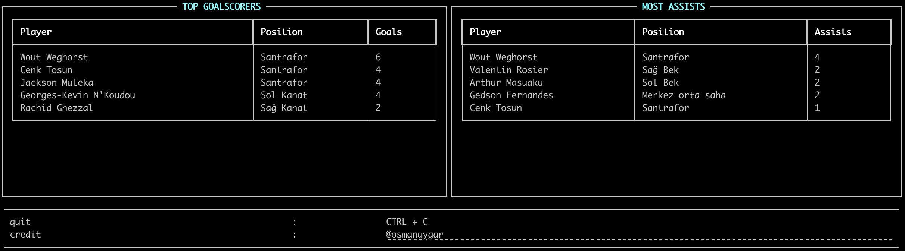

# Besiktas

Besiktas CLI! Aq biraz kosun!

## Installation on local

```shell
$ pip install besiktas
```
## Installation with Docker

```shell
$ docker run -ti osmanuygar/besiktas
```


## Usage
Main Page
```shell summary
$ besiktas
```

List of Players
```shell footballers
$ besiktas -kadro
```

List of Top Scorers
```shell footballers
$ besiktas -stats
```

